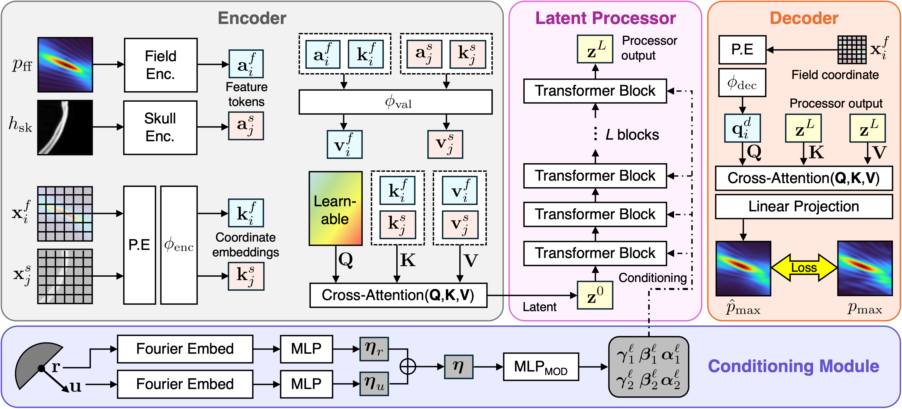

# tFUSOperator: Operator Learning for Transcranial Focused Ultrasound Digital Twins

## Overview

  

This repository contains the official implementation of  **"tFUSOperator: Operator Learning for Transcranial Focused Ultrasound Digital Twins**", accepted to the _Workshop on Digital Twin for Healthcare 2026 (at MICCAI 2026)_.

## Features
- tFUSOperator model
- Python codes for training, evaluation, loading dataset
- [Pre-trained model weights](https://drive.google.com/drive/folders/1seuVuacGfyq_Wdr-kNaoCAAWYJUo2gQ8?usp=sharing)
> Note: Dataset will be provided upon reasonable request.

## 0. Installation
Clone this repository: `git clone https://github.com/CMME-Lab/tFUSOperator.git` 
Install all prerequisites with `pip install -r requirements.txt`

## 1. Preparing dataset
- Dataset will provided upon reasonable request.
- Locate the '.h5' files in your desired root directory.
- Specify the dataset path using the `'--data_path'` argument when running `train.py`.

<b>How to prepare your custom dataset</b>

Each skull is stored as one HDF5 file (`s01.h5`, ..., `s13.h5`). Within a file, volumes are indexed by transducer position along the first axis, and grouped by frequency:
| Path | Shape | Description |
|---|---|---|
| `field/F{FREQ}/ff` | `(Npos, Nz, Ny, Nx)` | free-field pressure volumes |
| `field/F{FREQ}/pmax` | `(Npos, Nz, Ny, Nx)` | target peak-pressure volumes |
| `skull/CT` | `(Npos, Nz, Ny, Nx)` | skull volume (CT) |
| `skull/MR` | `(Npos, Nz, Ny, Nx)` | skull volume (MR) |
| `input/P_ROI` | `(Npos, 3)` | focal ROI center, voxel index (x, y, z) |
| `input/S_ROI` | `(Npos, 3)` | skull ROI center, voxel index (x, y, z) |
| `input/T_pos` | `(Npos, 3)` | transducer position (x, y, z) |
| `input/T_angle` | `(Npos, 3)` | transducer focal-axis unit vector (x, y, z) |
| `cond/<name>` | `(Npos, ...)` | optional extra scalar/vector conditions |

- `{FREQ}` is the frequency in Hz (e.g. `field/F250000` for 250 kHz). Provide one `field/F{FREQ}` group per operating frequency, and list the frequencies you want to load via `--frequencies`.
- `Npos` is the number of transducer positions per skull (300 in our setup). A sample is addressed as `(skull, position, frequency)`.
- Volumes follow the MATLAB `(Nx, Ny, Nz, Npos)` convention; when written to HDF5, h5py exposes the axes reversed as `(Npos, Nz, Ny, Nx)`. The loader transposes each slice back to `(Nx, Ny, Nz)` internally, so store volumes in this reversed layout.
- `skull/CT` and `skull/MR` share the same positions; select one at run time with `--skull_modality`.
- `cond/` is optional and reserved for additional conditioning variables; leave it empty if unused.

Place all `.h5` files under one directory and pass it to `train.py` via `--data_path`.

## 2. Training and evaluation
Running `train.py` trains the model and, once training finishes, automatically evaluates it on the held-out test set using the best checkpoint. All outputs are written to `{output_dir}/{run_name}/` (default: `./runs/{run_name}/`):

- `ckpt_best.pt`, `ckpt_last.pt` — model checkpoints
- `test_results.json` — final metrics on the test set
- `history.json`, `training.log` — training curves and logs
- `figs/` — prediction plots (only when `--plot` is set)

> Example usage : 
`python train.py --run_name my_experiments --data_path ./my_root_path --gpu_num 0 --modality mr --plot`

## Authors
**Minjee Seo**, Haris Ghafoor, Minju Seol, Seonaeng Cho, Kyungho Yoon

School of Mathematics and Computing (Computational Science and Engineering), Yonsei University, Seoul, Republic of Korea

## Acknowledgement
This work was supported by the National Research Foundation of Korea (NRF) grant funded by the Korea government (MSIT) (No. RS-2024-00335185). This work was also supported by the Korea Medical Device Development Fund grant funded by the Korea government (the Ministry of Science and ICT, the Ministry of Trade, Industry and Energy, the Ministry of Health & Welfare, the Ministry of Food and Drug Safety) (Project Number: RS-2026-25543484).

## License
MIT License

## Contact
For any queries, please reach out to [Minjee Seo](mailto:islandz@yonsei.ac.kr).